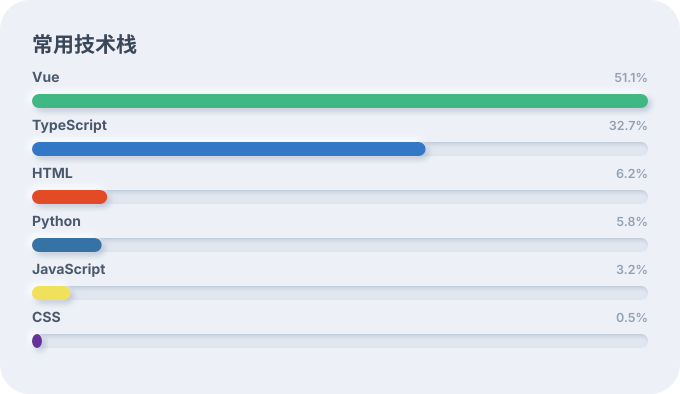

<h1>wodepig</h1>

<a href="https://github.com/wodepig">@wodepig</a> · <a href="https://github.com/xxdlovo">@xxdlovo</a>

---

## 〇一 / 提交记录

  <picture>
    <source media="(prefers-color-scheme: dark)" srcset="assets/snake-dark.svg">
    <source media="(prefers-color-scheme: light)" srcset="assets/snake.svg">
    
  </picture>

---

## 〇二 / 开源数据

数据来源：<a href="https://github.com/wodepig?tab=repositories">个人仓库</a> + <a href="https://github.com/xxdlovo?tab=repositories">xxdlovo</a>

<!-- STATS:START -->

  
38

  
开源仓库

  
9

  
累计 Star

  
6

  
个人关注者

  
Vue

  
最常用语言

  
2967

  
GitHub 天数

<!-- STATS:END -->

---

## 〇三 / 技术栈

  

---

## 〇四 / 最近更新

<!-- RECENT:START -->
| 项目 | 语言 | 更新日期 |
| --- | --- | --- |
| [xxdl-webext](https://github.com/wodepig/xxdl-webext) | Vue | 2026-09-16 |
| [xxdl-tools](https://github.com/wodepig/xxdl-tools) | Vue | 2026-09-15 |
| [xxdl-nuxt-admin](https://github.com/xxdlovo/xxdl-nuxt-admin) | Vue | 2026-09-05 |
| [file-update](https://github.com/wodepig/file-update) | Vue | 2026-08-03 |
<!-- RECENT:END -->

<!-- UPDATED:START -->
更新于 2026-09-19 23:27（北京时间）
<!-- UPDATED:END -->

